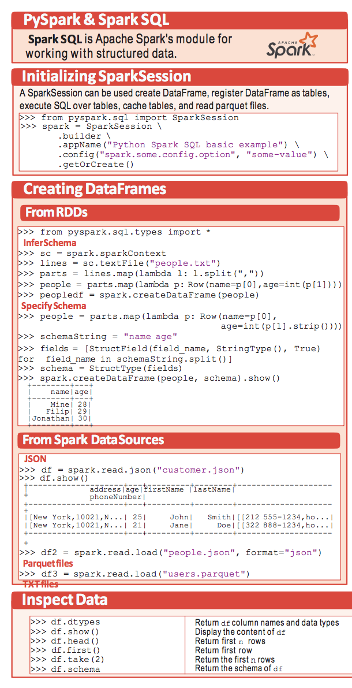
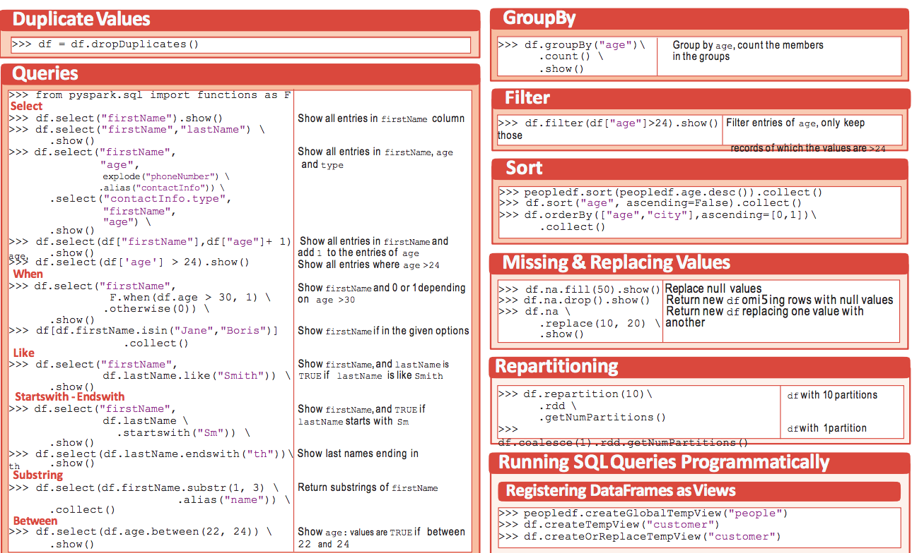
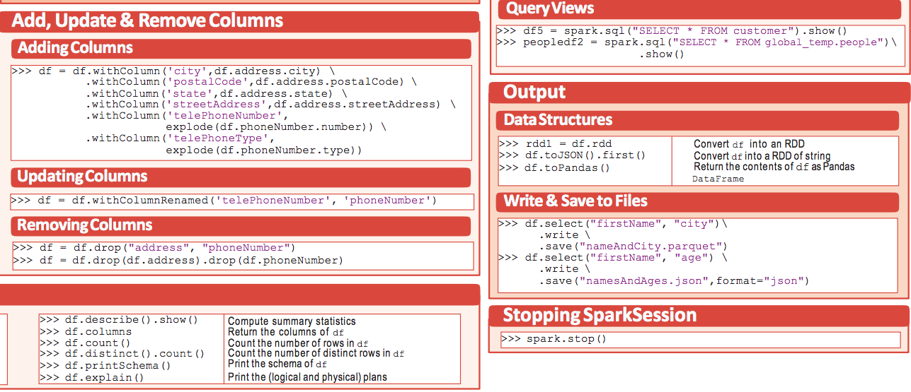

# PySpark cheat sheets




# Code for Cheat Sheet
Ref: https://www.jie-tao.com/how-to-use-dataframe-in-pyspark/
```python
## Initializing Spark Session
from pyspark.sql import SparkSession
spark = SparkSession \
        .builder \
        .appName("example project") \
        .config("spark.some.config.option", "some-value") \ # set paramaters for spark
        .getOrCreate()

# Create DataFrames
## From RDDs
from pyspark.sql.types import *
sc = spark.sparkContext
lines = sc.textFile("people.txt")
parts = lines.map(lambda l: l.split(","))
people = parts.map(lambda p: Row(name=p[0],age=int(p[1])))
peopledf = spark.createDataFrame(people)
people = parts.map(lambda p: Row(name=p[0],
schemaString = "name age"
fields = [StructField(field_name, StringType(), True) for field_name in schemaString.split()]
schema = StructType(fields)
spark.createDataFrame(people, schema).show()

## From Spark Data Source
# JSON
df = spark.read.json("customer.json")

# Use Maptype to read dynamic columns from JSON
customSchema = StructType([
                StructField("col1", StringType(),True),
                                StructField("event", MapType(StringType(),StringType()))])
spark.read.schema(customSchema).jason(path)

# Parquet files
df3 = spark.read.load("users.parquet")
# TXT files
df4 = spark.read.text("people.txt")
# CSV files
df5 = spark.read.format("csv").option("header", true).option("inferSchema", true).load("csvfile.csv")
# MS SQL
jdbcUrl = "jdbc:sqlserver://{0}:{1};database={2}".format(jdbcHostname, jdbcPort, jdbcDatabase)
connectionProperties = {
  "user" : jdbcUsername,
  "password" : jdbcPassword,
  "driver" : "com.microsoft.sqlserver.jdbc.SQLServerDriver"}
pushdown_query = "(select * from employees where emp_no < 10008) emp_alias"
df = spark.read.jdbc(url=jdbcUrl, table=pushdown_query, properties=connectionProperties)
# or we can use
# collection = spark.read.sqlDB(config)
display(df)

#=================================================================
# Dataframe Manipulation
from pyspark.sql import functions as F
# select & where
df.select("column1","column2", explod("phonenumber").alias("contactInfo"), df['age']>24).show()

# join
df = dfa.join(dfb, dfa.id==dfb.id & dfa.name == dfb.name, how ='left') 
df = dfa.join(dfb, dfa.id==dfb.id | dfa.name == dfb.name , how ='right')
df = dfa.join(dfb, dfa.id==dfb.id, how ='full')
df = dfa.join(dfb, dfa.id==dfb.id)
df = dfa.crossjoin(dfb)

# distinct count
from pyspark.sql.functions import countDistinct
df = df.groupby('col1','col2').agg(countDistinct("col3").alias("others"))

# ambiguous column handle
# both date and endpoint_id exist in two dataframes
df_result = df_result.join(df_result2, ["date","endpoint_id"],how="left") 

# exits and not exits
new_df = df.join(
    spark.table("target"),
    how='left_semi',
    on='id')

new_df = df.join(
    spark.table("target"),
    how='left_anti',
    on='id')

# when
df.select("first name", F.when(df.age>30,1).otherwise(0))

# like
df.select("firstName", df.lastName.like("Smith"))

# startwith-endwith
df.select("firstName", df.lastName.like("Smith"))

# substring
df.select(df.firstName.substr(1,3).alias("name"))

# between
df.select(df.age.between(22,24))

# add columns
df = df.withColumn('city',df.address.city) \
    .withColumn('postalCode',df.address.postalCode) \
    .withColumn('state',df.address.state) \
    .withColumn('streetAddress',df.address.streetAddress) \
    .withColumn('telePhoneNumber',
    explode(df.phoneNumber.number)) \
    .withColumn('telePhoneType',
    explode(df.phoneNumber.type))

# update column name
df = df.withColumnRenamed('prename','aftername')

# removing column
df = df.drop("ColumnName1","columnname2")

# group by
df.groupby("groupbycolumn").agg({"salary": "avg", "age": "max"})

# filter
df.filter(df["age"]>24).show()

# Sort
df.sort("age",ascending=False).collect()

# Missing & Replace values
df.na.fill(value)
df.na.drop()
df.na.replace(value1,value2)
df["age"].na.fill(value)

# repartitioning
df.repartition(10)\ df with 10 partitions
    .rdd \
    .getNumPartitions()
df.coalesce(1).rdd.getNumPartitions()

# union and unionAll
df.union(df2)

# windows function
import sys
from pyspark.sql.window import Window
import pyspark.sql.functions as func
windowSpec = \
  Window
    .partitionBy(df['category']) \
    .orderBy(df['revenue'].desc()) \
    .rangeBetween(-3,3) # or rowframe:  .rowBetween(Window.unboundedPreceding, Window.currentRow)
dataFrame = sqlContext.table("productRevenue")
revenue_difference = \
  (func.max(dataFrame['revenue']).over(windowSpec) - dataFrame['revenue'])
dataFrame.select(
  dataFrame['product'],
  dataFrame['category'],
  dataFrame['revenue'],
  revenue_difference.alias("revenue_difference"))

from pyspark.sql.functions import percentRank, ntile
df.select(
    "k", "v",
    percentRank().over(windowSpec).alias("percent_rank"),
    ntile(3).over(windowSpec).alias("ntile3"))

# pivot & unpivot
df_data
    .groupby(df_data.id, df_data.type)
    .pivot("date")
    .agg(count("ship"))
    .show())

df.selectExpr(df_data.id, df_data.type, "stack(3, '2010', 2010, '2011', 2011, '2012', 2012) as (date, shipNumber)").where("shipNumber is not null").show()

# Remove Duplicate
df.dropDuplicates()

#================================================================
# Running SQL queries
# registering Dataframe as vies
peopledf.createGlobalTempView("people")
df.createTempView("customer")
df.createOrReplaceTempView("customer")
df5 = spark.sql("SELECT * FROM customer").show()
peopledf2 = spark.sql("SELECT * FROM global_temp.people")\
.show()
sqlContext.sql("SELECT * FROM df WHERE v IN {0}".format(("foo", "bar"))).count()

#==================================================================
# Output
Output

# Data convert
rdd = df.rdd
df.toJSON().first()
df.toPandas()

# write and save
df.select("columnname").write.save("filename",format="jason")

#===============================================================
# Check data
df.dtypes Return df column names and data types
df.show() Display the content of df
df.head() Return first n rows
df.first() Return first row
df.take(2) Return the first n rows
df.schema Return the schema of df
df.describe().show() Compute summary statistics
df.columns Return the columns of df
df.count() Count the number of rows in df
df.distinct().count() Count the number of distinct rows in df
df.printSchema() Print the schema of df
df.explain() Print the (logical and physical) plans

#================================================================
# Image Processing
# spark 2.3 provoid the ImageSchema.readImages API
image_df = spark.read.format("image").option("dropInvalid", true).load("/path/to/images")
# the structure of output dataframe is like
image: struct containing all the image data
 |    |-- origin: string representing the source URI
 |    |-- height: integer, image height in pixels
 |    |-- width: integer, image width in pixels
 |    |-- nChannels: integer, number of color channels
 |    |-- mode: integer, OpenCV type
 |    |-- data: binary, the actual image
# Then we can use sparkML to build and train the model, blew is a sample crop and resize process
from mmlspark import ImageTransformer
tr = (ImageTransformer() # images are resized and then cropped
    .setOutputCol("transformed")
    .resize(height = 200, width = 200)
    .crop(0, 0, height = 180, width = 180) )

smallImages = tr.transform(images_df).select("transformed")

#======================================================================
# Broadcast and Accumulator
# Broadcast is a read-only variable to reduce data transfer, mostly we use it for "lookup" operation. In Azure data warehouse, there is a similar structure named "Replicate".
from pyspark.sql import SQLContext
from pyspark.sql.functions import broadcast
 
sqlContext = SQLContext(sc)
df_tiny = sqlContext.sql('select * from tiny_table')
df_large = sqlContext.sql('select * from massive_table')
df3 = df_large.join(broadcast(df_tiny), df_large.some_sort_of_key == df_tiny.key)

# Accumulator is a write-only(except spark driver) structure to aggregate information across executor. We can understand it as a global variable, but write-only.
from pyspark import SparkContext 

sc = SparkContext("local", "Accumulator app") 
num = sc.accumulator(1) 
def f(x): 
   global num 
   num+=x 
rdd = sc.parallelize([2,3,4,5]) 
rdd.foreach(f) 
final = num.value 
print "Accumulated value is -> %i" % (final)
```
