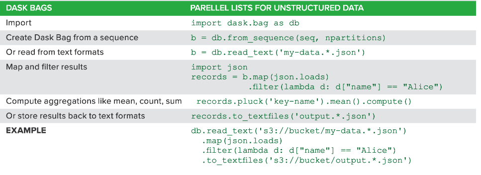

Table of Contents
=================
   * [Introduction](#introduction)
   * [Usage](#usage)
   * [Python data pipelines](#python-data-pipelines)
   * [Comparison with Spark](#comparison-with-spark)
   * [Dask collections (arrays, dfs, bags)](#dask-collections-arrays-dfs-bags)
   * [Useful Links](#useful-links)

# Introduction
Dask ( we can think of delayed task) is a parallel computing library for python with numpy/pandas as its backend.
It works on data larger than the capacity of RAM. In comparison to pandas, it has less number of methods but is 
memory efficient and works on larger data. For big data we have to use `PySpark ~TB` but for medium size data we
can use `Dask ~ 50GB`. PySpark is Scala based language and Dask is python based.

# Usage

# Python data pipelines

# Comparison with Spark

# Dask collections (arrays, dfs, bags)

# Useful Links
- https://www.analyticsvidhya.com/blog/2018/08/dask-big-datasets-machine_learning-python/

Note:
The images are collected from various online sources, I do not have any belongings to these images.
